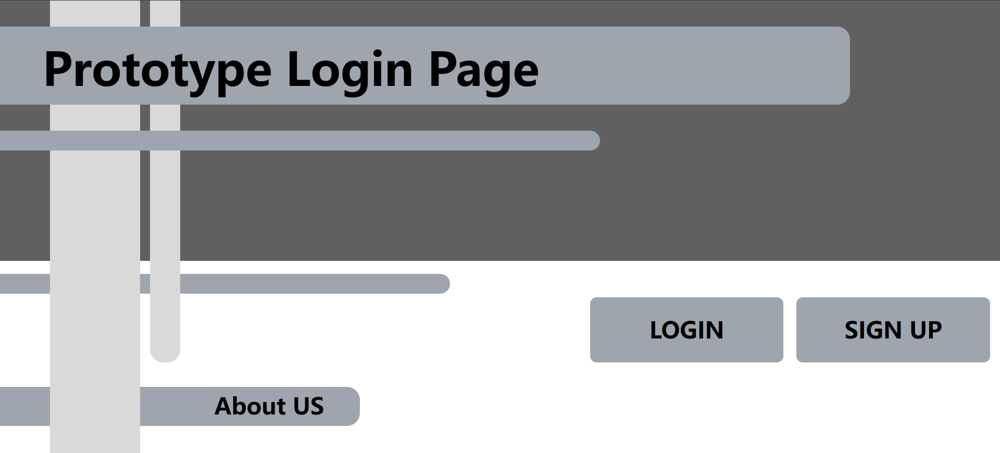
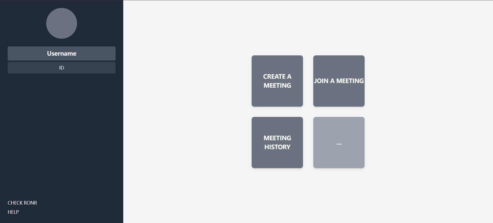
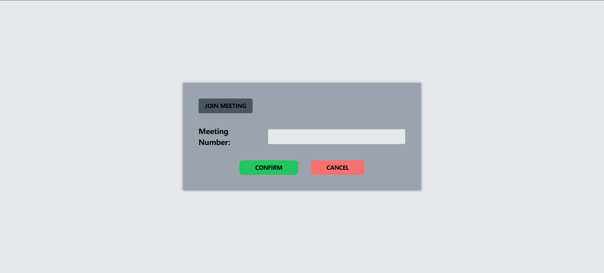

# cs432-web-programming

## Project Overview

This project is a web application designed to facilitate online meetings using the RONR (Robert's Rules of Order Newly Revised) meeting mode. The application provides a platform for users to register, log in, and participate in structured meetings, ensuring that discussions are orderly and decisions are made democratically.



## RONR Meeting Mode

RONR, or Robert's Rules of Order Newly Revised, is a widely used manual of parliamentary procedure that governs the conduct of meetings. It provides a framework for making decisions as a group, ensuring that all members have a voice and that meetings are conducted efficiently and fairly. The RONR meeting mode in this application helps users follow these procedures, making it easier to manage discussions, motions, and votes.

## How to Run the Frontend

To get started with the frontend of the application, follow these steps:

```bash
cd RONRmeeting-frontend
npm install
npm run dev
```

This will install the necessary dependencies and start the development server, allowing you to access the application in your browser.

## How to Run the Backend

To set up and run the backend server, follow these steps:

1. **Install Dependencies**: Navigate to the backend directory and install the required packages.

   ```bash
   cd backend
   npm install
   ```

2. **Set Up Environment Variables**: Create a `.env` file in the backend directory and add your MongoDB URI and JWT secret.

   ```
   MONGO_URI=your_mongodb_uri
   JWT_SECRET=your_jwt_secret
   ```

3. **Start the Server**: Run the server using the following command:

   ```bash
   npm run dev
   ```

   This will start the server with nodemon, allowing for automatic restarts on file changes.

## MongoDB Connection

The application uses MongoDB to store user data and meeting information. Ensure that your MongoDB instance is running and accessible via the URI specified in the `.env` file.

## Features

- **User Authentication**: Secure registration and login system.
- **Meeting Management**: Create and manage meetings using RONR procedures.
- **Real-time Collaboration**: Participate in meetings with live updates and interactions.
- **Structured Discussions**: Follow RONR guidelines to ensure orderly and democratic decision-making.

## Technologies Used

- **Frontend**: React, Vite
- **Backend**: Node.js, Express
- **Database**: MongoDB

## Contributing

This project is for Computer Science 432 Web Programming class at College of William & Mary, 2024 Fall.
Group Members:

- Aibo Li
- Huizhi Zhao
- Ajax Li
- Duohan Xu
- Mengyang He
- Colin Tang

## Preview




## License

This project is licensed under the MIT License.
